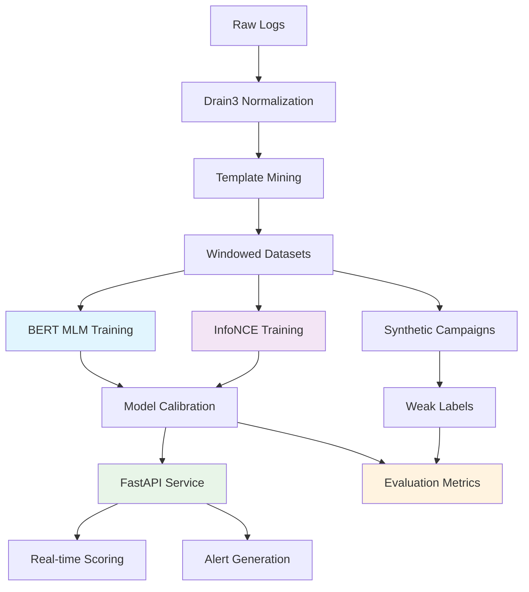

# LogBERT: Production-Ready Anomaly Detection for SSH Honeypot Logs

<div align="center">


**Transform SSH honeypot logs into actionable security intelligence using BERT-based anomaly detection**

[](https://www.python.org/downloads/)
[](https://pytorch.org/)
[](https://huggingface.co/transformers/)
[](https://fastapi.tiangolo.com/)
[](https://opensource.org/licenses/MIT)

</div>

## 🎯 What is LogBERT?

LogBERT is a **production-ready anomaly detection system** that analyzes SSH honeypot logs to identify suspicious activities and attack patterns. It combines modern NLP techniques with cybersecurity domain knowledge to provide:

- **🔍 Real-time anomaly detection** using BERT-based masked language modeling
- **🎪 Template-based log mining** with Drain3 for structured analysis  
- **🎭 Synthetic attack simulation** for evaluation without human labels
- **⚡ Production FastAPI service** with automated calibration
- **📊 Comprehensive evaluation** using weak labeling and metrics

## 🚀 Quick Start (10 Minutes)

### Prerequisites
```bash
# Python 3.9+ with pip
python --version  # Should be 3.9 or higher
```

### 1. Clone and Setup
```bash
git clone <repository-url>
cd cowrie_honeypot
make setup  # Creates directories and installs dependencies
```

### 2. Prepare Your Data

**Option A: File-based logs**
```bash
# Place your Cowrie logs in data/raw/
cp /path/to/your/cowrie.log data/raw/
# Supported formats: .log, .json files
```

**Option B: OpenSearch/Elasticsearch**
```yaml
# Edit configs/config.yaml
data:
  source_type: 'opensearch'
  opensearch:
    host: 'your-opensearch-host'
    index_pattern: 'cowrie-*'
```

### 3. Run Complete Pipeline
```bash
# For file-based data (recommended for first run)
make quickstart-files

# For OpenSearch data  
make quickstart-opensearch
```

This will:
1. ✅ Extract and normalize logs using Drain3
2. ✅ Build windowed datasets  
3. ✅ Train BERT-based anomaly detection model
4. ✅ Inject synthetic attacks for evaluation
5. ✅ Generate evaluation metrics

### 4. Start Inference Service
```bash
make serve
# API available at http://localhost:8000
# Interactive docs at http://localhost:8000/docs
```

### 5. Check Results
```bash
# View evaluation metrics
cat data/evaluation/evaluation_results_summary.txt

# Test the API
curl -X POST "http://localhost:8000/predict" \
  -H "Content-Type: application/json" \
  -d '{
    "logs": [
      "2024-01-01T10:00:00 New connection from 192.168.1.100",
      "2024-01-01T10:00:05 Failed password for root from 192.168.1.100"
    ],
    "source": "192.168.1.100"
  }'
```

**🎉 That's it! You now have a running LogBERT anomaly detection system.**

---

## 🏗️ Architecture Overview



### Key Components

| Component | Purpose | Technology |
|-----------|---------|------------|
| **🔧 Normalization** | Convert raw logs to structured templates | Drain3, Regex |
| **🧠 Training** | BERT-based masked language modeling | HuggingFace Transformers |
| **🎯 Evaluation** | Synthetic attacks + weak labeling | Custom rules, Metrics |
| **⚡ Inference** | Real-time anomaly scoring service | FastAPI, Calibration |
| **🔄 Orchestration** | End-to-end pipeline management | Prefect Workflows |

---

## 📋 Detailed Usage

### Training Your Own Model

```bash
# Step-by-step training
make extract-data     # Normalize logs with Drain3
make build-dataset    # Create training windows  
make train-mlm        # Train BERT MLM model
make train-infonce    # Optional: Train contrastive model
make eval            # Comprehensive evaluation
```

### Configuration

Edit `configs/config.yaml` to customize:

```yaml
# Key configuration options
training:
  mlm:
    model_name: 'distilbert-base-uncased'  # Base model
    max_epochs: 10
    batch_size: 32
    learning_rate: 2e-5

inference:
  detection_threshold: 0.7  # Anomaly threshold
  calibration:
    method: 'rolling_percentile'
    window_size: 1000

evaluation:
  synthetic_attacks:
    campaigns_per_type: 5
    attack_types: ['brute_force', 'command_injection', 'data_exfiltration']
```

### API Usage

```python
import requests

# Single prediction
response = requests.post("http://localhost:8000/predict", json={
    "logs": ["Failed login attempt from suspicious IP"],
    "source": "192.168.1.100"
})

print(response.json())
# Output: {"anomaly_score": 0.85, "is_anomaly": true, "calibrated_score": 0.92}

# Batch prediction  
response = requests.post("http://localhost:8000/predict_batch", json={
    "batch": [
        {"logs": ["Normal login"], "source": "10.0.0.1"},
        {"logs": ["wget malware.sh; chmod +x malware.sh"], "source": "192.168.1.100"}
    ]
})
```

### Docker Deployment

```bash
# Build images
make docker-build

# Run training
make docker-train

# Run inference service
make docker-serve  # Available at http://localhost:8000

# Development environment
make docker-dev    # Interactive container with all tools
```

---

## 🎯 Evaluation & Metrics

LogBERT uses a **comprehensive evaluation framework** since human-labeled security data is rarely available:

### 1. Synthetic Attack Campaigns
```python
# Automatically generates realistic attack patterns:
- Brute force login attempts
- Command injection sequences  
- Data exfiltration patterns
- Network reconnaissance scans
```

### 2. Weak Labeling Rules
```python
# High-precision heuristics for pseudo-ground truth:
- Failed login threshold (≥10 failures/60s)
- Suspicious command chains (wget + chmod patterns)
- File operation anomalies (unusual downloads)
- Network connection anomalies (high frequency)
```

### 3. Key Metrics

| Metric | Target | Description |
|--------|--------|-------------|
| **Recall@Synthetic** | ≥90% | Detection rate on injected attacks |
| **Precision@K** | ≥60% | Accuracy of top-K alerts |
| **Detection Latency P95** | ≤10s | Time to detect attack campaigns |
| **Alert Volume** | <50/day | Manageable alert rate |
| **Drift Detection** | Automatic | Template and score distribution monitoring |

### Example Results
```bash
# View evaluation summary
cat data/evaluation/evaluation_results_summary.txt

=== LogBERT Evaluation Summary ===
Synthetic Attack Recall: 0.923 (✓)
Precision@50: 0.680 (✓)  
P95 Detection Latency: 8.2s (✓)
Alert Volume: 23.4 alerts/day (✓)
Drift Detected: No
All Targets Met: Yes
```

---

## 🔧 Advanced Configuration

### Threshold Selection Guide

LogBERT provides **adaptive threshold selection** based on your environment:

```python
# Conservative (fewer false positives)
detection_threshold: 0.8
calibration:
  percentile_threshold: 95  # Top 5% as anomalies

# Balanced (recommended)  
detection_threshold: 0.7
calibration:
  percentile_threshold: 90  # Top 10% as anomalies

# Aggressive (higher recall)
detection_threshold: 0.5
calibration:
  percentile_threshold: 85  # Top 15% as anomalies
```

### Multi-Source Calibration

```yaml
# Separate calibration per source network
inference:
  calibration:
    method: 'per_source'  # or 'global'
    source_grouping: 'subnet'  # Group by /24 subnet
    min_samples_per_source: 100
```

### Custom Attack Patterns

```python
# Add custom synthetic attacks in eval/inject_campaigns.py
class CustomAttackGenerator:
    def generate_advanced_persistence(self):
        return [
            "useradd -m attacker",
            "echo 'attacker ALL=(ALL) NOPASSWD:ALL' >> /etc/sudoers",  
            "mkdir -p /home/attacker/.ssh",
            "echo 'ssh-rsa AAAA...' >> /home/attacker/.ssh/authorized_keys"
        ]
```

---

## 📊 Monitoring & Operations

### Health Checks
```bash
# System health
make health-check

# Service status
curl http://localhost:8000/health
# Output: {"status": "healthy", "model_loaded": true, "uptime": "2h 15m"}
```

### Prefect Workflows

```bash
# Start Prefect server
prefect server start

# Deploy workflows  
python -m flows.prefect_flow

# Monitor at http://localhost:4200
```

### Logging & Metrics

LogBERT provides structured logging and metrics:

```python
# Application logs
tail -f logs/logbert.log

# Metrics export (Prometheus compatible)
curl http://localhost:8000/metrics
```

---

## 🛠️ Development

### Setting Up Development Environment

```bash
# Full development setup
make dev-setup

# Install pre-commit hooks
pre-commit install

# Run tests
make test

# Code quality
make lint format type-check
```

### Project Structure

```
cowrie_honeypot/
├── configs/           # YAML configuration files
├── normalization/     # Drain3 template mining
├── dataset/           # Windowed dataset building
├── models/            # BERT training (MLM + InfoNCE)
├── eval/              # Synthetic attacks + evaluation
├── inference_service/ # FastAPI service + calibration
├── flows/             # Prefect orchestration
├── tests/             # Unit and integration tests
├── data/              # Generated data directories
│   ├── raw/           # Input logs
│   ├── normalized/    # Drain3 processed logs  
│   ├── datasets/      # Training/test datasets
│   └── evaluation/    # Evaluation results
└── models/            # Saved model checkpoints
```

### Testing

```bash
# Unit tests
pytest tests/unit/ -v

# Integration tests  
pytest tests/integration/ -v

# End-to-end tests
pytest tests/e2e/ -v

# Coverage report
pytest --cov=. --cov-report=html
```

---

## 🐛 Troubleshooting

### Common Issues

**Q: "No templates found during normalization"**
```bash
# Check log format and Drain3 config
python -c "
import yaml
with open('configs/config.yaml') as f:
    config = yaml.safe_load(f)
print('Drain config:', config['normalization']['drain'])
"

# Verify log file format
head -5 data/raw/your_log_file.log
```

**Q: "Model training runs out of memory"**
```yaml
# Reduce batch size in config.yaml
training:
  mlm:
    batch_size: 16  # Reduce from 32
    gradient_accumulation_steps: 2  # Maintain effective batch size
```

**Q: "FastAPI service returns 500 errors"**
```bash
# Check model loading
curl http://localhost:8000/health

# View service logs
docker logs <container_id>
```

**Q: "Poor evaluation results"**
```bash
# Check data quality
python -c "
import pandas as pd
df = pd.read_parquet('data/datasets/train_windows.parquet')
print(f'Dataset size: {len(df)}')
print(f'Unique templates: {df[\"template_ids\"].nunique()}')
print(f'Avg window size: {df[\"window_size\"].mean():.1f}')
"

# Retrain with more data or adjust hyperparameters
```

### Performance Tuning

```yaml
# For large datasets (>1M logs)
normalization:
  drain:
    max_node_depth: 10  # Reduce from 15
    sim_th: 0.8         # Increase from 0.4

# For faster training
training:
  mlm:
    model_name: 'distilbert-base-uncased'  # Faster than 'bert-base-uncased'
    max_length: 256     # Reduce from 512
```

---

## 📈 Roadmap

### Current Version (v1.0)
- ✅ BERT-based anomaly detection
- ✅ Drain3 template mining
- ✅ Synthetic evaluation framework  
- ✅ FastAPI inference service
- ✅ Prefect orchestration

### Next Release (v1.1)
- 🔄 OpenSearch/Elasticsearch integration
- 🔄 Advanced drift detection
- 🔄 Multi-model ensemble
- 🔄 Grafana dashboards
- 🔄 Kubernetes deployment

### Future (v2.0)
- 🔮 Graph neural networks for attack sequence modeling
- 🔮 Federated learning across multiple honeypots
- 🔮 Advanced adversarial attack simulation
- 🔮 Integration with SOAR platforms

---

## 🤝 Contributing

We welcome contributions! Please see our [Contributing Guide](CONTRIBUTING.md) for details.

### Quick Contribution Setup
```bash
# Fork the repository and clone
git clone <your-fork-url>
cd cowrie_honeypot

# Set up development environment
make dev-setup

# Create feature branch
git checkout -b feature/your-feature-name

# Make changes and test
make dev-test

# Submit pull request
```

---

## 📄 License

This project is licensed under the MIT License - see the [LICENSE](LICENSE) file for details.

---

## 🙏 Acknowledgments

- **Drain3** algorithm for log template mining
- **Hugging Face Transformers** for BERT implementation  
- **Cowrie Honeypot** community for log format insights
- **FastAPI** for high-performance web framework
- **Prefect** for workflow orchestration

---

## 📞 Support

- **📖 Documentation**: [Full docs](https://logbert-docs.example.com)
- **💬 Discussions**: [GitHub Discussions](https://github.com/your-repo/discussions)
- **🐛 Issues**: [GitHub Issues](https://github.com/your-repo/issues)
- **📧 Email**: logbert-support@example.com

---

<div align="center">

**🔒 Secure your infrastructure with intelligent log analysis**

[](https://github.com/your-repo/logbert)
[](https://twitter.com/LogBERT)

Made with ❤️ by the LogBERT team

</div>